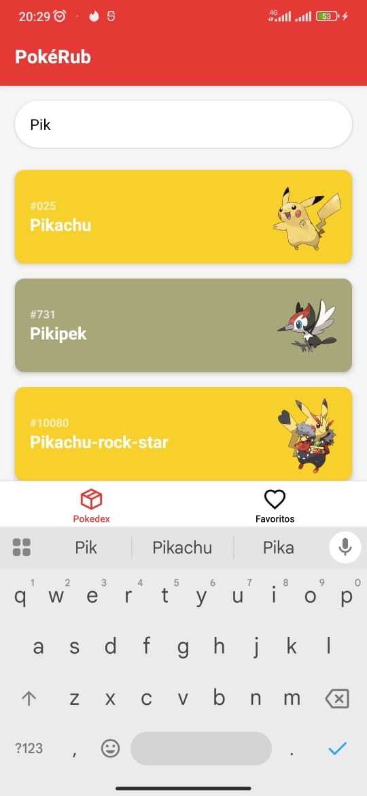
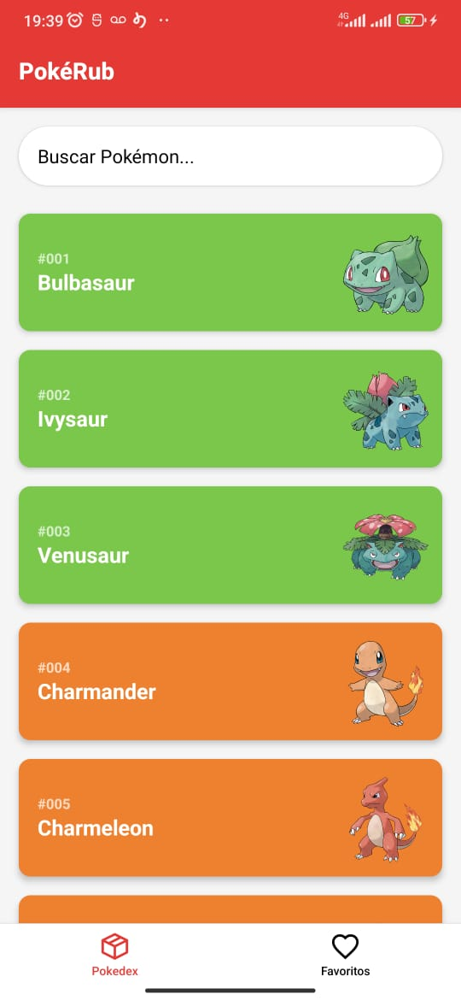
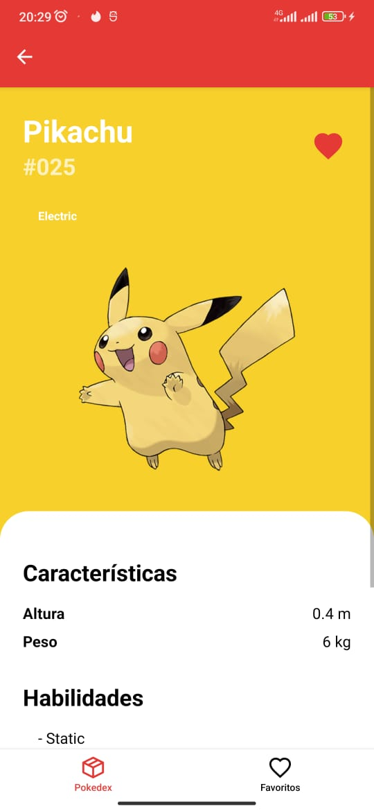
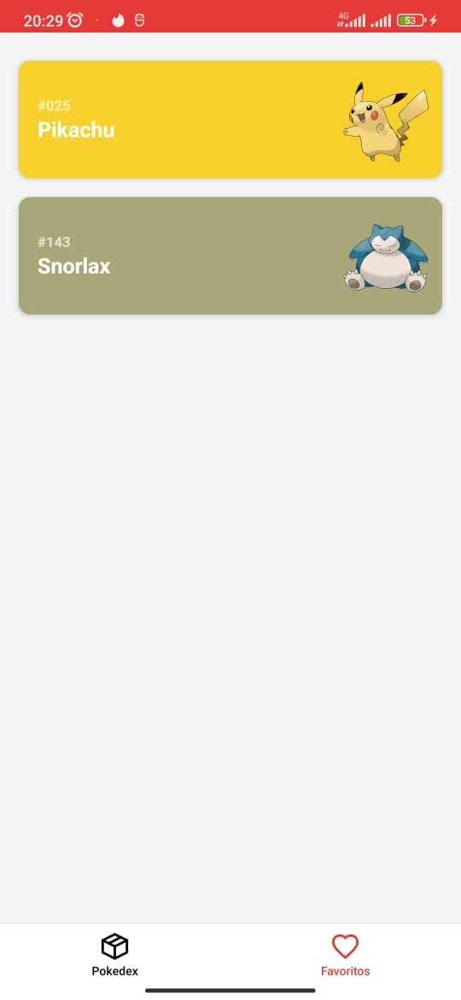

# PokeRub - Desafio Rubcube

Projeto para vaga de Frontend Mobile. Uma Pokédex simples para explorar as tecnologias propostas.

> Referência do desafio:  
> https://github.com/rubcube/hiring-exercises/blob/master/frontend-mobile/Instructions.md#exerc%C3%ADcio-b-ricky-and-morty-rmapp  
>  
> Escolhi o exercício PokeRub por ser mais complexo e permitir demonstrar melhor minhas habilidades.

---

## Prints e Evidências do Produto Final

### Tela Principal (Listagem e Busca)

Aqui é possível visualizar a lista completa de Pokémon com barra de busca integrada para filtragem por nome.

<div align="center">
  
  
</div>

---

### Tela de Detalhes do Pokémon

Mostra as informações detalhadas do Pokémon selecionado, incluindo tipo, altura, peso, habilidades e cadeia de evolução visual.

<div align="center">
  
</div>

---

### Tela de Favoritos

Exibe os Pokémon que o usuário marcou como favoritos para consulta rápida.

<div align="center">
  
</div>

---

## Como Testar e Rodar a Aplicação

### Pré-requisitos

- Node.js (v18 ou superior)
- npm ou yarn
- Ambiente React Native configurado para seu sistema operacional (Android Studio / Xcode). Veja o [guia oficial](https://reactnative.dev/docs/environment-setup).

> Obs: O desafio foi homologado apenas no ambiente Android.

---

### Instalação

1. Clone o repositório.
2. No terminal, acesse a pasta do projeto e rode:
    ```bash
    npm install
    # ou
    yarn install
    ```

---

### Execução

1. Inicie o Metro Bundler:
    ```bash
    npm start
    # ou
    yarn start
    ```

2. Em outro terminal, rode o app no emulador ou dispositivo:

    - Android:
        ```bash
        npm run android
        # ou
        yarn android
        ```
    - iOS (macOS necessário):
        ```bash
        npm run ios
        # ou
        yarn ios
        ```

---

